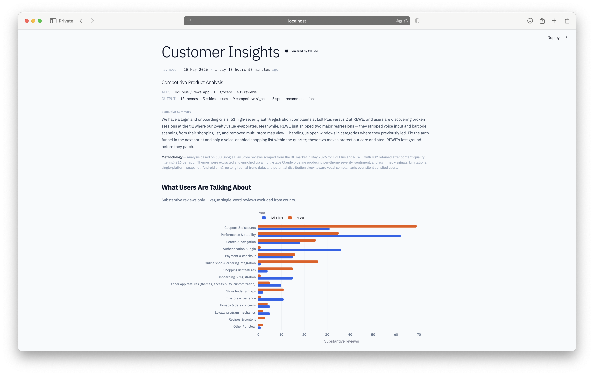
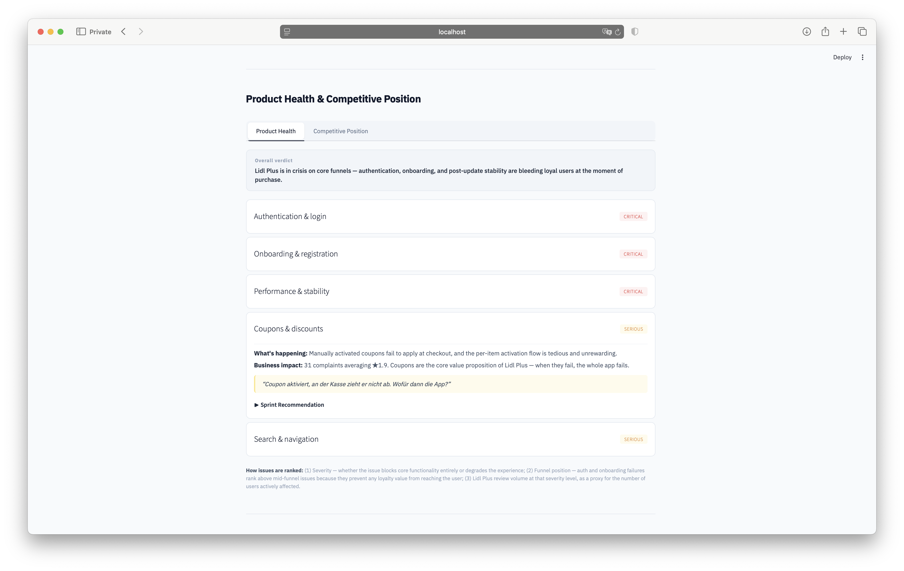
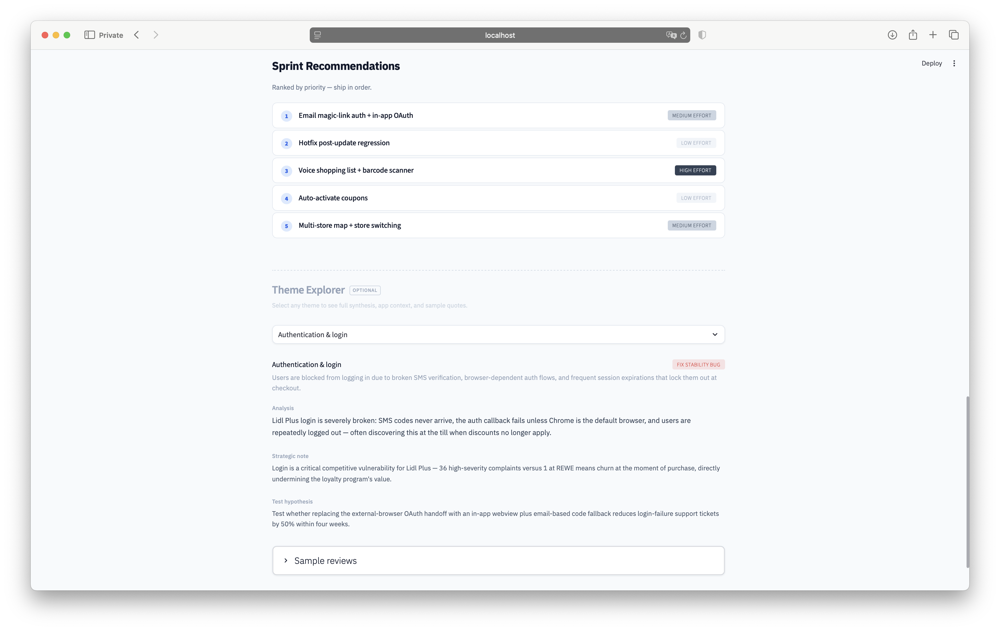

# Customer Insights (Synthesizer)

**Turn hundreds of app store reviews into a competitive intelligence briefing a PM can act on.**

Most retail apps generate thousands of reviews that no product manager has time to read. This tool processes raw app store reviews through a multi-stage AI pipeline and produces a structured competitive analysis: ranked critical issues, competitive positioning (lead / trail / battleground), strategic opportunities with urgency windows, and sprint-ready A/B test recommendations.

This demo analyzes **Lidl Plus vs. REWE** from the Lidl Plus product team's perspective — the kind of briefing a Voice-of-Customer function would produce manually over a week. The engine is perspective-agnostic: switching to REWE's viewpoint, swapping in different apps, or targeting a different industry requires only a config change, not a code rewrite.

> ⬇️ **[Live demo →](https://customer-insight-synthesizer.streamlit.app)**






## Key Findings (Lidl Plus vs. REWE, May 2026)

The analysis surfaced a striking asymmetry between the two apps:

- **Lidl Plus is breaking foundationally.** 36 high-severity authentication complaints vs. 1 at REWE. Users discover broken sessions at the checkout — the exact moment the loyalty program should deliver value. Combined with post-update regressions and onboarding failures, the core funnel is leaking.

- **REWE has feature gaps users want filled.** 26 complaints about missing online shop integration (the app is perceived as a brochure despite a separate delivery service existing). 15 complaints about a shopping list regression that stripped previously loved features.

- **Two open battlegrounds.** REWE just shipped regressions removing voice-enabled shopping lists and multi-store map views. Neither app currently offers these. Whichever team ships first owns the category for the next 12–18 months.

The full briefing includes 5 ranked sprint recommendations with concrete A/B test hypotheses, effort estimates, and expected impact metrics.


## How It Works

```
┌──────────────┐     ┌──────────────┐     ┌──────────────┐     ┌──────────────┐
│   Scraper    │────▶│   Stage 1    │────▶│   Stage 2    │────▶│   Stage 3    │
│              │     │  Extraction  │     │  Aggregation │     │  Synthesis   │
│ Google Play  │     │              │     │              │     │              │
│ App Store    │     │ Per-review:  │     │ Per-theme:   │     │ Cross-theme: │
│ reviews      │     │ theme, senti-│     │ frequency,   │     │ competitive  │
│ (DE market)  │     │ ment, severi-│     │ severity     │     │ briefing,    │
│              │     │ ty, feature  │     │ distribution,│     │ strategic    │
│              │     │ requests,    │     │ representa-  │     │ opportunities│
│              │     │ content      │     │ tive quotes, │     │ sprint recs  │
│              │     │ quality      │     │ A/B test     │     │ with A/B     │
│              │     │              │     │ ideas, PM    │     │ hypotheses   │
│              │     │              │     │ actions      │     │              │
└──────────────┘     └──────────────┘     └──────────────┘     └──────────────┘
     600 raw              432                 13 themes           1 PM briefing
     reviews           substantive           synthesized         with 5 ranked
                        reviews                                  sprint actions
```

**Stage 1 — Per-review extraction.** Reviews are sent in batches to Claude (Sonnet) with a structured extraction prompt. Each review is classified by theme, sentiment, severity, and content quality. A Stage 1.5 re-classification pass expands initially under-specified categories and flags low-content noise ("gut", "top", "super") for exclusion.

**Stage 2 — Theme aggregation.** Pure Python aggregation computes per-theme statistics (frequency, severity distribution, comparative signal). Representative quotes are selected by severity diversity, not cherry-picked for extremes. Claude then synthesizes per-theme descriptions, PM action categories, and A/B test hypotheses.

**Stage 3 — Competitive synthesis.** The full theme report is sent to Claude with a perspective-aware prompt that frames the output from one app's product team viewpoint. Output is a structured JSON briefing with executive summary, product health assessment, competitive positioning, strategic opportunities with timing windows, and ranked sprint recommendations.

All intermediate outputs are cached as files (`reviews_enriched.csv`, `themes_report.json`, `pm_briefing.json`), so any stage can be re-run independently without re-processing upstream data.


## Tech Stack

| Component        | Tool                            |
|------------------|---------------------------------|
| Data collection  | `google-play-scraper` (Python)  |
| AI pipeline      | Anthropic Claude API (Opus 4.7) |
| Data processing  | pandas                          |
| Frontend         | Streamlit + Plotly              |


## What I'd Build Next

**v2 — Cross-channel synthesis.** Add Trustpilot and idealo reviews as secondary sources. App store reviews capture product/UX feedback; Trustpilot captures service/brand feedback. The distinction itself (which complaints live where) is a valuable insight most VoC teams miss.

**v3 — Industry swap.** Run the same pipeline on other product or services to demonstrate industry portability. The prompt chain adapts; the architecture stays identical.

**v4 — Longitudinal tracking.** Schedule weekly scrapes and track theme trends over time. "Authentication complaints dropped 40% after the March release" is a more powerful insight than a single snapshot.

**v5 — Perspective switching as a feature.** Parameterize the Stage 3 prompt so any user can select their company and see the briefing reframed from their perspective. One engine, n customers — the model for an internal tool or a SaaS product.


## Methodology

Analysis based on 600 Google Play Store reviews scraped from the German market in May 2026 (300 Lidl Plus, 300 REWE). After content-quality filtering, 432 substantive reviews were retained (216 per app). Themes were extracted via a multi-stage Claude pipeline with structured JSON output, producing per-review classification (theme, sentiment, severity, feature requests) and per-theme aggregation (frequency, severity distribution, comparative asymmetry signals).

**Limitations:** Single-platform snapshot (Android only); no longitudinal trend data; potential distribution skew toward vocal detractors over silent satisfied users; user voice quotes in the PM briefing are representative composites, not verbatim single reviews. The perspective framing (Lidl Plus product team) reflects a deliberate analytical choice, not an endorsement.


## License

Copyright © 2026. All rights reserved.

This software is made available for viewing and evaluation purposes only. No permission is granted to use, copy, modify, or distribute this software for commercial purposes.